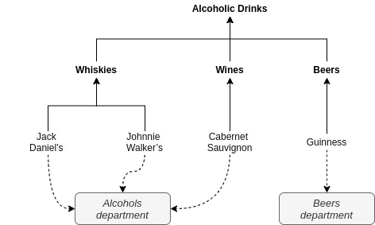

=============
Tree Labeller
=============

Command line tools that helps label all leaves of a tree based only on a small sample of manually labelled leaves.

Labelling is a semi-automatic iterative process. You start by labeling few samples and the rule-based prediction algorithm tries to learn and tag the rest of the data set for you. You then correct predicted labels for a sample of most ambiguous items and the algorithm repeats prediction based on labels you provided. The algorithm suggests the most diverse sample of items to label, i.e. coming from different categories, so you don't waste time with samples that have high chance of having same label.

Sample scenarios include:

- Assigning shop departments to products organized in a taxonomy of categories
- Mapping taxonomy of book categories in one library to flat vocabulary of book categories in another library
- Annotating training data organized in a tree

Here's example of the first task:

Install
=======

Install with pip:

.. code-block:: bash

    pip install tree-labeller

Usage
=====

Describe your taxonomy in form of YAML file, e.g.: ``products.yaml``

.. code-block:: yaml

    name: categories
    children:
    - name: Alcoholic Drinks
      children:
      - name: Whiskies
        children:
        - name: Jack Daniel's
        - name: Johnnie Walker's
      - name: Wines
        children:
        - name: Cabernet Sauvignon
      - name: Beers
        children:
        - name: Guinness

Create labelling task:

.. code-block:: bash

    create_task \
        --dir ./my_labels \
        --tree ./tree.yaml \
        --allowed-labels Label1,Label2,Label3

Generate a sample:

.. code-block:: bash

    label --dir ./my_labels --sample 10

Annotate a file with samples.

Run predictions and generate another sample of ambiguous and non labeled items. Items in the sample are sorted starting from the most ambiguous ones, i.e., having many possible label candidates.

.. code-block:: bash

    label --dir ./my_labels --sample 10

Repeat the process until you are satisfied.

After each iteration you will get statistics to help you decide when to stop labelling:

.. code-block:: bash

      Iteration    Manual    Univocal    Ambiguous    Missing    Total    Allowed Labels
    -----------  --------  ----------  -----------  ---------  -------  ----------------
              1         0          0%           0%       100%    14456                0%
              2        10         71%          29%         0%    14456               37%

In the ideal situation we want to have 100% of univocal predictions, 0% of ambiguous and missing predictions and 100% of allowed labels (departments) coverage while providing as few manual labels as possible.

If you decide to continue, you can do one or more of the following actions:

- Correct ambiguous predicted labels in a sample.
- Correct your previous manual labels.
- Label with ``?`` to skip the product from the prediction (it won't be sampled next time).
- Label with ``!`` to tell the algorithm that the product ,and perhaps its category, are not present in the target shop (the algorithm will try to learn other similar products that might be not present in a shop)
- If one of departments have no products labeled so far, you can search for matching products manually and add them to the sample with correct label. For search you can use last TSV file with univocal predicted labels.
- You can also occasionally review univocal predicted labels and correct them by adding to the sample.

Demo
====

Download sample taxonomy file of products and their categories from `Frisco.pl`_ online shop.

.. code-block:: bash

    fetch_frisco > frisco.yaml

Create task for labelling Frisco products with departments from `Marketpoint`_, local grocery shop in Krakow.

.. code-block:: bash

    create_task \
            --dir ./marketpoint \
            --tree ./frisco.yaml \
            --allowed-labels Alcohols,Beers,Vegetables

.. _Frisco.pl: https://www.frisco.pl/
.. _Marketpoint: https://market-point.pl/sklepy/sklep-krakow-rynek-falecki-1/

Background
==========

See theoretical background_.

.. _background: docs/introduction.md

Development
===========

Install poetry:

.. code-block:: bash

    curl -sSL https://raw.githubusercontent.com/python-poetry/poetry/master/get-poetry.py | python -

Install dependencies:

.. code-block:: bash

    poetry install

Activate virtual environment:

.. code-block:: bash

    poetry shell

Install locally to test scripts:

.. code-block:: bash

    deactivate
    poetry build
    pip install dist/tree_labeller-0.1.0-py3-none-any.whl
