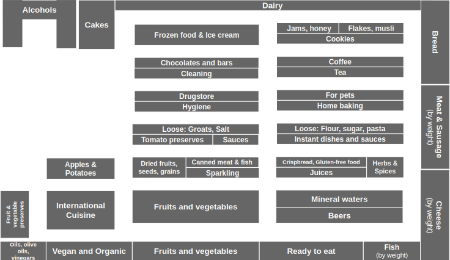

====
Demo
====

Here is a quick demonstration how to map products from a real online shop, `Frisco.pl`_, to departments in a real local grocery, `Marketpoint`_.

.. _Frisco.pl: https://www.frisco.pl/
.. _Marketpoint: https://market-point.pl/sklepy/sklep-krakow-rynek-falecki-1/

Use case
--------

Imagine you have a large pile of products, and you want to categorize those products by shop departments they can be found in. This can be a daunting task if you want to do it one by one. However, products live in groups, and often products from the same group can be found in the same department. For instance, Jack Daniel's and Johnnie Walker's whiskies both can be found in the Alcohols department. If we choose and label one product from *each* group manually, we can automatically label the remaining products. This can save us a lot of time and probably money! Especially, if you want to do it for many, many shops: locations of products and available departments vary from one shop to another.

But... did I say labeling *each* group manually? There might still be many more groups than we can label manually. Fortunately, groups of products are organized into larger groups, and again, products from those larger groups often tend to be located in the same department. Although, with certain exceptions. For instance, Jack Daniel's whisky and Cabernet Sauvignon wine are in the Alcohols department, but Guinness can be found in my grocery store in a different department, Beers. Even though whiskies, wines, and beers are in the same large group of alcoholic drinks.

.. image:: imgs/tree_1.png

Preparing source taxonomy
-------------------------

First step is to prepare a source taxonomy in YAML format. For this demo, we have prepared a tool that downloads Frisco.pl taxonomy of products and converts to the expected format:

.. code-block:: bash

    fetch_frisco > frisco.yaml

Identifying allowed labels
--------------------------

Labels in our case are shop departments. Same products can be organized differently, depending on the shop. See, for instance, how products are distributed across different departments of Marketpoint.

Understanding semantics also of those labels will be necessary when providing manual labels and verifying automatically predicted labels. For instance, note that sometimes, related products are split into two distant locations, e.g., most vegetable preserves are in Fruits & vegetable preserves on the left except for canned tomatoes that can be found in Tomato preserves in the middle. Sometimes, same products can be found in two distant departments, e.g., cheese can be both in Diary and in Cheese (by weight).

Labelling
---------

Create task for labelling Frisco products with departments from Marketpoint.

.. code-block:: bash

    create_task \
        --dir ./marketpoint \
        --tree ./frisco.yaml \
        --allowed-labels Alcohols,Beers,Vegetables

Sample products for labelling:

.. code-block:: bash

    label ./marketpoint
