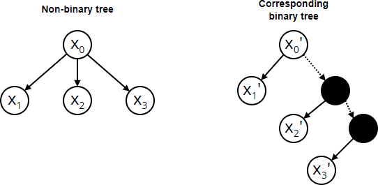

# Sampling taxonomy leaves for manual labelling

Our goal is to select a sample of taxonomy leaves that an annotator will manually label. Based on manual labels we will infer labels for other unlabelled leaves. Since we can select only a small subset of unlabelled leaves, we need to do it wisely. If we select leaves that have the same parent, there is high chance both will be annotated with the same label. For instance, Jack Daniel's and Johnnie Walker's both can be labelled with "Alcohols department". On the other hand, if we select Guinness beer instead of Johnnie Walker's whisky, we could cover two different shop departments: Alcohols and Beers. 

## Math, math, math

More formally, we want to select leaves that have [lowest common ancestor](https://en.wikipedia.org/wiki/Lowest_common_ancestor) (LCA) as close to the root as possible. 

Even more formally, given a taxonomy tree $T$, we want to find a subset $N$ of $n$ leaves that are farthest apart. I.e., we want to find $N$ that maximizes function:

$$g(N)=\sum\limits_{x_1,x_2 \in N}{d(x_1,x_2)}$$  

where $d(x_1, x_2)$ is a distance between two vertices/nodes $x_1$ and $x_2$. 

Now imagine, there is a subtree in $T$ with many very deep leaves that are close to each other but very far from leaves in other subtrees of $T$. If we defined the distance as just the shortest number of edges between two nodes, then maximizing $g(N)$ would lead to solutions where many related leaves (i.e., leaves with same parent or close ancestor) get selected as in the example with whiskies. Therefore, we introduce weighted distance:

$$d(x_1, x_m)=\sum\limits_{i=1}^{m-1}{w(x_i,x_{i+1})}$$  

where $x_1, x_2, ..., x_m$ is a walk (sequence of nodes) and $w$ is a weight that is higher for edges closer to the taxonomy root:

$$w(x_{i+1}, x_i) = w(x_i, x_{i+1})=10^{-depth(x_{i+1})}$$  

## Implementing that math

So how do we actually implement finding the farthest leaves in a tree? 

If we have a binary tree, we should be able to solve this using [dynamic programming](https://en.wikipedia.org/wiki/Dynamic_programming).  Let $A[v,j,k]$ denote the maximum possible value of the objective function

$$g'(N) = \sum_{x_1,x_2 \in N} d(x_1,x_2) + k \sum_{x \in N} d(v,x)$$

where $N$ ranges over all subsets of exactly $j$ leaves from among those that are descendants of $v$ (i.e., leaves of the subtree rooted at $v$) and $k$ is the number of leaves in the remaining part of the tree (i.e., not being descendants of $v$).

If $v$ is a leaf, then $A[v,j,k]=0$ for all $j,k$. If $v$ has one child $v'$, it is easy to compute that $A[v,j,k]=A[v',j,k] + jk$ for all $j,k$.

So now suppose $v$ has two children $v',v''$.  Then we can work out a recursive equation for $A[v,j,k]$ in terms of values $A[w,\cdot,\cdot]$ where the $w$'s are descendants of $v$:

$$ A[v,j,k] = \max A[v',j',k+j''] + A[v'',j'',k+j'] + 2 j' j'' + jk$$

where $j',j''$ range over all values such that $j'+j'' = j$, $0 \le j',j'' \le j$.  The intended meaning is that $j'$ counts the number of leaves in $N$ that are descendants of $v'$ and $j''$ counts the number of leaves in $N$ that are descendants of $v''$.  In other words, we split $N=N' \cup N''$ where $N'$ contains $j'$ leaves from the descendants of $v'$, and $N''$ contains $j''$ leaves from the descendants of $v''$; then (loosely speaking) we compute the maximum value of $g'(N)$ in terms of the maximum values of $g'(N')$ and $g'(N'')$.  The $2jj'$ term counts distances of the form $d(x_1,x_2)$ where $x_1 \in N'$ and $x_2 \in N''$.  The $jk$ term accounts for the fact that the $j$ root-to-leaf paths all need to be extended by one edge.

$A$ can be calculated by traversing $T$ in post order.

## Non-binary tree case

If we have an arbitrary tree, not necessarily a binary tree, then it can be converted to a binary tree as follows. Children from the original tree are encoded as a left child in the binary tree and edges to left children preserve their original weights. Remaining edges, those to right children, have 0 weight. Here is an example of how such conversion could look like.

In the example above, dotted line indicates 0 weight.

## Acknowledgements

The original dynamic programming algorithm, without weights, comes from:
* D.W. (https://cs.stackexchange.com/users/755/d-w), Finding n farthest leaves in a tree, URL (version: 2021-01-18): https://cs.stackexchange.com/q/134439